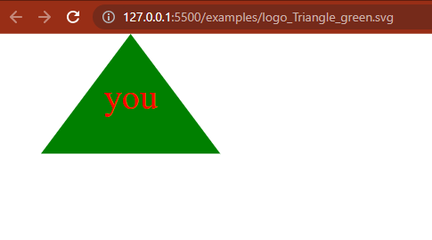
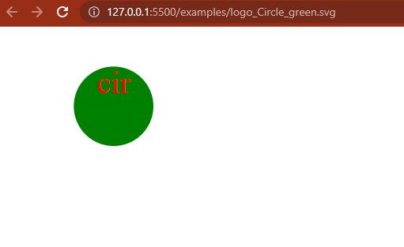
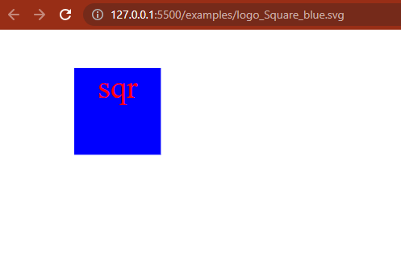
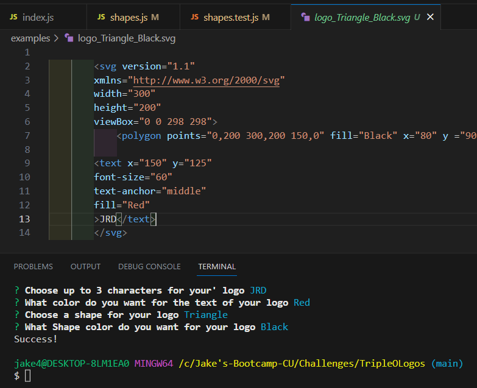
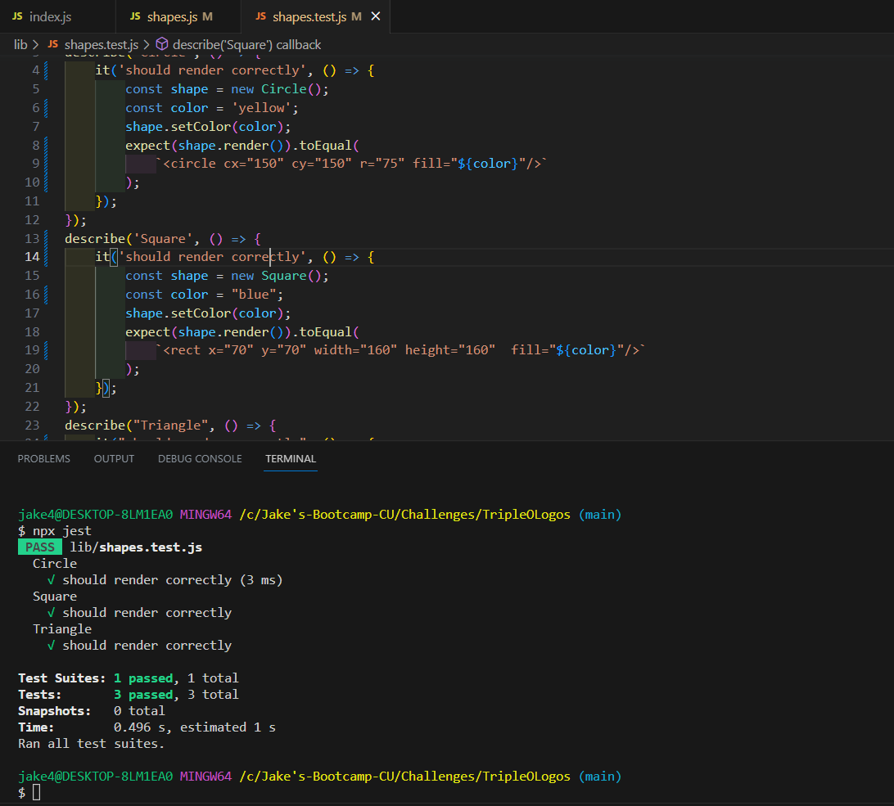

<h1 align="center">Triple o Logos</h1> 

<h2 align="center">Description</h2>
Triple O Logo is a node application that generates a svg logo of either a triangle,circle, or square based off of what the user wants,
the user may also enter up to a 3 digit tag for their logo,
colors can also be entered for both the shape and text.
My task was to make a node application that makes a logo with a shape and some letters. It was a bit overwhelming at first not knowing where to start, I ended up writing to much and ended up with overlapping tags, i eneded up getting it to work after a while of working on one shape, then the other two were much easier.

## Table of Contents

- [Installation](#installation)
- [Usage](#usage)
- [Photos](#photos)
- [Credits](#credits)
- [License](#license)
- [Features](#features)
- [How to Contribute](#how-to-contribute)
- [Tests](#tests)
- [Questions](#questions)

<h2 align="center"> Installation</h2>

steps required
Install jest and inquirer, you can clone the repository and run in vs code.

<h2 align="center">Photos</h2>

Image 1 is a triangle svg red and green

Image 2 is a green and red circle

Image 3 is blue and orange square

<h2 align="center">Usage</h2>
Lets a user generate a svg logo with up to three letters and customize colors.

<h2 align="center">Credits</h2>
inquirer making things possible

<h2 align="center">License</h2>
refer to repo for licenses

license is a MIT license.

<h2 align="center">Badges</h2>

<h2 align="center">Features</h2>
you can select a shape, color, text and text color of a svg logo.
A video demonstration is available [here](https://drive.google.com/file/d/1V2pJ8UWFlDz1pYfRwTqhXTwRmZQstx15/view).

<h2 align="center"> How to Contribute</h2>
clone repository and make merge request or open an issue.

<h2 align="center">Tests</h2>

test run to rendor a triangle,circle, and square. also gives a color to each test. test passed.

just clone repository, open in terminal and instal packages, then run application.

<h2 align="center">Questions</h2>
reach my git hub profile at (https://github.com/DupeaJ)
  
If you have additional questions you can reach me at jacobsemail@gmail.com
